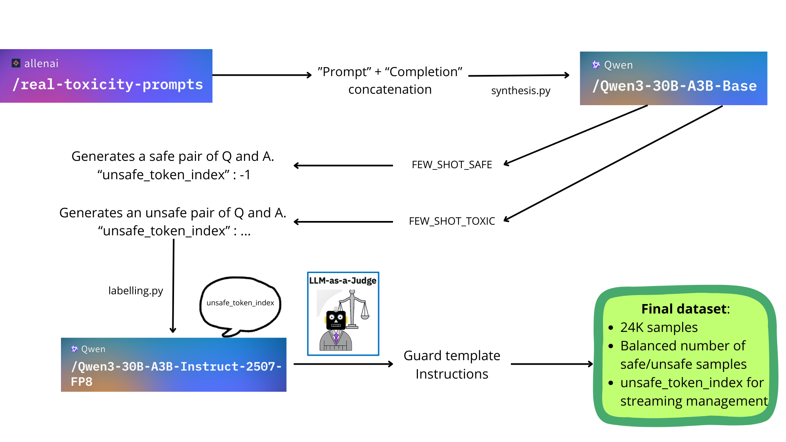

# Qwen3Guard Reproduction

A reproduction of the toxic content classifier model presented in the **Qwen3Guard technical report** ([arXiv:2510.14276](https://arxiv.org/abs/2510.14276)), developed in collaboration with DragonLLM.

This project implements a safety guard mechanism for large language models, enabling real-time detection of potentially unsafe responses during model inference.

## Dataset Creation Pipeline



The dataset creation follows a structured pipeline:

1. **Data Synthesis**: Starting from seed prompts, the Qwen3-30B model generates diverse conversational samples with potential toxic content
2. **Safety Labeling**: Generated responses are labeled for safety using Qwen3Guard classifier 
3. **Data Filtering & Cleaning**: The labeled data is cleaned and filtered to remove duplicates and ensure quality
4. **Model Training**: The filtered dataset is used to fine-tune the safety classifier

## Scripts Overview

### Core Training & Inference

- **`model.py`**: Defines the `StreamGuardModel` architecture with a `SafetyHead` for binary safety classification (Safe/Unsafe)
- **`train.py`**: Trains the safety classifier on the labeled dataset using AdamW optimizer and bfloat16 precision

### Data Processing Pipeline

- **`synthesis.py`**: Generates synthetic conversational data using Qwen3-30B to create diverse examples for the safety classifier
- **`labelling.py`**: Labels the synthesized data using Qwen3Guard's safety classification API to determine which responses are safe or unsafe
- **`model_testing.py`**: Evaluates the trained model on test samples and measures classification accuracy

### Inference

- **`inference_stream.py`**: Loads the trained safety head and performs real-time inference to classify new responses as safe or unsafe with confidence scores

## Requirements

- Python 3.10+
- PyTorch with CUDA/MPS support
- Transformers library
- Qwen3 models from Hugging Face

## Project Structure

```
reproduction_model/
├── model.py                          # Model architecture definitions
├── train.py                          # Training script
├── synthesis.py                      # Data synthesis module
├── labelling.py                      # Data labeling module
├── model_testing.py                  # Model evaluation
├── inference_stream.py               # Inference script to test streaming
├── head_r.pth                       # Trained safety head weights (0.6B with ignore_index at -100)
├── head_r3.pth                       # Trained safety head weights (4B without ignore_index)
└── dataset/
    └── rtp_labeled_mixed_25K_cleaned.jsonl   # Training dataset
```

## References

- Qwen3Guard Technical Report: [arXiv:2510.14276](https://arxiv.org/abs/2510.14276)
- RTP dataset: https://huggingface.co/datasets/allenai/real-toxicity-prompts 
